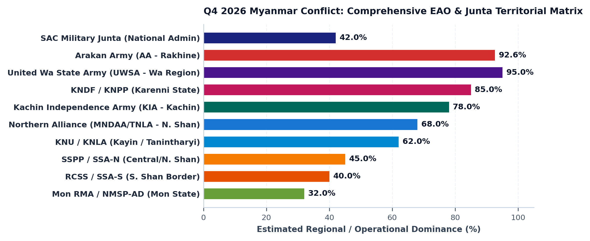

# Strategic Brief: Q4 2026 Myanmar EAO Territorial Dynamics (Comprehensive Edition)
**Date:** October 02, 2026 | **Classification:** OSINT / Strategic Intelligence

## Executive Summary
In Q4 2026, Myanmar’s armed landscape has fractured into a multi-theater geopolitical matrix. The military junta (SAC) is confined to ~42% uncontested administrative reach nationwide. Ethnic Armed Organizations (EAOs) command strategic dominance across peripheral frontiers, led by the Arakan Army’s 92.6% control of Rakhine State, the United Wa State Army's (UWSA) heavily armed armed-neutrality buffer, enduring inter-Shan rivalry between SSPP and RCSS, and the unified Mon revolutionary front (NMSP-AD/RMA) mobilizing in the south.

---

## Key Territorial Shifts (Q4 2026)
- **Junta (SAC) Footprint:** The military regime retains uncontested administrative control in only ~42% of townships, maintaining emergency rule in 63+ jurisdictions while relying on standoff airstrikes from fortified urban garrison hubs [Ref: SAC-M, 2026; ACLED, 2026].
- **Shan State Multi-Actor Fragmentation:**
  - **UWSA Autonomy:** The United Wa State Army (~30,000–35,000 troops) exercises total de facto independence across Special Region 2 and southern border bases, maintaining armed neutrality under Chinese mediation to safeguard CMEC infrastructure [Ref: PRIO, 2026; MPM, 2026].
  - **SSPP vs. RCSS Rivalry:** In Central and Southern Shan, historic rivalry between the SSPP (Wan Hai, ~9,000 troops) and RCSS (Loi Tai Leng, ~9,000 troops) persists despite ceasefires, with over 40 clashes documented as SSPP consolidates northern sectors and RCSS secures the Thai border [Ref: BNI-MPM, 2026; SHAN, 2026].
- **Mon State Resistance (NMSP-AD / RMA):** In Southern Myanmar, the New Mon State Party-Anti-Dictatorship (NMSP-AD) and Mon Liberation Army merged into the unified **Ramonnya Mon Army (RMA)** (~3,500 troops), breaking from the legacy NCA-signatory NMSP to conduct coordinated ambushes along the Ye-Mawlamyine coastal transit corridor [Ref: MPM, 2026; ACLED, 2026].
- **Western & Northern Dominance (AA & KIA):** The Arakan Army governs 92.6% of Rakhine State (14/17 townships) and Paletwa, while the KIA (~20,000 troops) controls northern border corridors, Momauk, and Hpakant jade mines, anchoring nationwide resistance logistics [Ref: ISP-Myanmar, 2026; ACLED, 2026].
- **Eastern Front (KNDF & KNU):** The KNDF/KNPP controls >85% of Karenni/Kayah State surrounding Loikaw, while the KNU/KNLA commands critical trade corridors along the Thai border and Myawaddy Asian Highway 1 [Ref: MPM, 2026].

---

## Data Visualization

### Pan-Ethnic Armed Organizations (EAO) Balance of Forces
| Organization | Est. Strength | Primary Control Theater | Strategic Infrastructure / Posture |
| :--- | :--- | :--- | :--- |
| **UWSA (Wa)** | 30,000–35,000 | Wa Region (Special Region 2), Mong Yawn | Panghsang HQ, Heavy Armor/MANPADS, De Facto State [Ref: PRIO] |
| **Arakan Army (AA)** | 38,000–42,000 | Rakhine State (92.6%), Paletwa (Chin) | Western Coast, Bangladesh Border, Kyaukphyu Encirclement [Ref: ISP] |
| **KIA (Kachin)** | 18,000–22,000 | Kachin State, Hpakant, China Border | Laiza HQ, Hpakant Jade Mines, Upper Sagaing Logistics [Ref: ACLED] |
| **KNU / KNLA** | 18,000–22,000 | Kayin State, Bago/Mon Border | Myawaddy Asian Highway 1, Salween River Border [Ref: MPM] |
| **KNDF / KNPP** | 10,000–12,000 | Kayah / Karenni State (85%+) | Loikaw Cantonment Siege, Mawchi Mineral Complexes [Ref: MPM] |
| **SSPP / SSA-N** | 8,000–10,000 | Central & Northern Shan State | Wan Hai HQ, Kyethi, Hsipaw, Telecom Anti-Scam Border Security [Ref: SHAN] |
| **RCSS / SSA-S** | 8,000–10,000 | Southern Shan State (Thai Border) | Loi Tai Leng Redoubt, Mongton/Mawkmai Corridor, NCA Signatory [Ref: MPM] |
| **Mon RMA / NMSP-AD** | 3,000–4,000 | Mon State, Northern Tanintharyi | Ye-Mawlamyine Highway, SCEF Coalition, Anti-Junta Offensive [Ref: MPM] |

---

## Strategic Implications & Outlook
- **Balkanized Governance Matrix:** Myanmar is no longer a centralized state in civil war, but an array of autonomous ethnic proto-states (Wa, Arakan, Kachin, Karenni) managing border trade, justice, and social services outside Naypyidaw's authority [Ref: IISS, 2026].
- **Inter-Ethnic Frontier Friction:** Latent territorial competition between overlapping ethnic jurisdictions (SSPP vs RCSS, MNDAA vs TNLA, Pa-O PNLA vs regime proxies) requires localized mediation to prevent intra-resistance conflict [Ref: MPM, 2026].
- **Humanitarian Telemetry Deployment:** Cross-border relief from Thailand, India, and Bangladesh requires direct operational coordination with respective EAO civic administrations (APRG, KIO, KNU, Mon RMA) backed by offline acoustic early-warning nodes against junta air raids [Ref: Parla Early-Warning System, 2026].

---

## Verified Primary Sources
1. [Myanmar Peace Monitor (BNI-MPM)](https://mmpeacemonitor.org) — *Comprehensive EAO Profiles, Armed Conflict Dashboards & Town Trackers (2026)*
2. [ACLED (Armed Conflict Location & Event Data)](https://acleddata.com) — *Myanmar Conflict Dynamics (2026)*
3. [Institute for Strategy and Policy - Myanmar (ISP-Myanmar)](https://ispmyanmar.com) — *Territorial & Governance Review (2026)*
4. [Peace Research Institute Oslo (PRIO)](https://prio.org) — *Non-State Armed Groups in Myanmar (2026)*
5. [Shan Herald Agency for News (SHAN)](https://shannews.org) — *Shan State Conflict & Security Monitoring (2026)*
