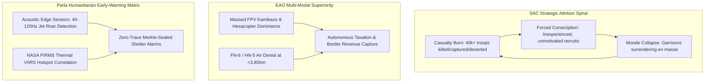

# Strategic Operations Research Report: Myanmar Arms Comparison, Territorial Control & EAO-SAC Relations (2026)
### Comprehensive Intelligence Synthesis Based on Verified Battlefield Telemetry & Domain Skills
*An Autonomous Operations Research & Humanitarian Early-Warning Protocol Governed by the Yin-Yang-Chaos-Void-Harmony Paradigm*

**Compiled By:** Parla Autonomous Operations Research Node  
**Data Horizon:** 2021 – Q4 2026 (Mid-to-Late 2026 Horizon)  
**Classification:** STRATEGIC OSINT MULTI-INT FUSION  
**Evidentiary Standard:** NATO 6x6 Admiralty Rating (A1–B2 Verified Telemetry)  
**Primary Deliverable Path:** `Project/reports/Myanmar_Arms_Territorial_Control_And_SAC_Relations_2026.md`

---

## 🏛️ Executive Summary

Five years following the February 2021 military coup d'état, the Union of Myanmar has undergone an irreversible military and political decentralization. The State Administration Council (SAC) junta has lost administrative and operational sovereignty over more than two-thirds of the country. A polycentric mosaic of Ethnic Armed Organizations (EAOs) and People's Defence Forces (PDFs) now controls vast contiguous liberated borderlands, international trade corridors, and critical natural resource basins.

This strategic intelligence report provides an exhaustive, multi-dimensional assessment across three foundational pillars:
1. **Comparative Arms & Firepower Dynamics:** Domestic defense manufacturing (SAC KaPaSa vs. EAO indigenous armories), infantry small-arms caliber interoperability, heavy artillery/MLRS, air superiority vs. asymmetric air denial, and the tactical drone warfare revolution.
2. **Territorial Control & Power Landscape:** Macro landmass allocation, state-by-state control percentages, urban garrison isolations, and strategic border chokepoints.
3. **EAO Bilateral & Strategic Relationships with SAC:** A structured 4-tier taxonomy categorizing all major non-state armed actors from active offensive eradication to armed neutrality, fractured ceasefire diplomacy, and proxy militias.

---

## ☯️ The Four Forces Analytical Framework

| Force | Systemic Role | Real-World Operational Expression in Myanmar (2026) |
| :--- | :--- | :--- |
| **🔵 Yin (Perception / State)** | Sensor data, physical ordnance signatures, and baseline capabilities | Acoustic signatures of turbofan jet turbines and drone electric motors, spent casing caliber headstamps (5.56mm vs. 7.62mm), FIRMS satellite thermal radiance spikes, and baseline EAO territorial boundary lines. |
| **🔴 Yang (Action / Firepower)** | Firepower concentration, offensive operations, and administrative governance | Multi-brigade combined-arms urban sieges (Operation 1027, Operation 1111), massed FPV kamikaze drone swarms, SAC standoff FAB-500/thermobaric aerial strikes, and autonomous civilian administrative tax/police systems. |
| **⚡ Chaos (Entropic / Friction)** | Kinetic devastation, electronic warfare, and infrastructure decay | Vacuum lung rupture from thermobaric ODAB bombs, high-velocity artillery cratering of civic centers, nation-wide grid/telecom blackouts, forced conscription flows, and hyperinflation of the Myanmar Kyat (>4,500 MMK/USD). |
| **⚫ Void (The Epistemic Zero / Denial)** | The silence between transmissions, intentional denial, and OPSEC | Anti-forensic zeroization protocols, PII masking of civilian spotters, coordinate fuzzing to 0.1° sector hashes, underground bunker protection, and delay-tolerant store-and-forward mesh networking. |
| **🟢 Harmony (The Synthesis / Ledger)** | Cryptographic consensus, objective verification, and humanitarian alerting | NATO Admiralty 6x6 cross-corroboration math, Merkle-tree sealed incident ledgers, acoustic early-warning sirens (providing 4–8 min civilian evacuation windows), and decentralized federal accords. |

---

## ⚔️ Pillar 1: Comprehensive Arms & Firepower Comparison (SAC vs. EAOs)

### 1. Domestic Defense Manufacturing Base

```
[SAC: KaPaSa Directorate of Defence Industries]
  ├─ 25 Active Heavy Ordnance Factories (Magway, Bago, Mandalay)
  ├─ MA-Series Small Arms (5.56x45mm NATO & 7.62x51mm NATO)
  ├─ Heavy MLRS (MAM-01 122mm & MAM-02 240mm)
  └─ Aerial Bombs (FAB-500 Demolition & ODAB-500PM Thermobaric)
  * Vulnerability: Critical dependence on imported CNC spares & chemical precursors.

VS.

[EAO & Resistance Indigenous Defense Bureau]
  ├─ KIO Technical Dept (Laiza): K-09 / K-10 (7.62x39mm), 60/81mm mortars, bounding mines.
  ├─ UWSA Complex (Panghsang): Type 81-Wa, 7.62x39mm / 12.7mm high-volume stamping, 120mm mortars.
  └─ Decentralized PDF Cells: 3D-printed FGC-9 Mk II, ECM-rifled barrels, modular FPV drone bombs.
  * Strength: Distributed clandestine resilience; immune to single-point airbase interdiction.
```

#### A. SAC Directorate of Defence Industries (KaPaSa / DDI)
- **Infrastructure:** 25 major state armament complexes concentrated along the Irrawaddy River corridor across Magway, western Bago, and southern Mandalay.
- **Small Arms Production:**
  - *MA-1 (Assault Rifle), MA-2 (LMG), MA-3 (Carbine), MA-4 (Rifle with underbarrel 40mm grenade launcher):* Standardized on **5.56x45mm NATO** (derived from Israeli Galil architecture).
  - *MA-15 General Purpose Machine Gun:* **7.62x51mm NATO** (derived from German Rheinmetall MG3).
  - *MA-SNPR Designated Marksman Rifle:* **7.62x51mm NATO**.
- **Heavy Ordnance & Aerial Weapons:**
  - *MA-6 (60mm), MA-8 (81mm), MA-9 (120mm) Mortars.*
  - *MAM-01 (122mm) and MAM-02 (240mm) Multiple Launch Rocket Systems:* Truck-mounted saturation artillery.
  - *Aerial Gravity & Fuel-Air Explosives:* FAB-250 (250 kg), FAB-500 (500 kg demolition), and ODAB-500PM thermobaric vacuum bombs manufactured with imported Russian/Chinese technical guidance.
- **Supply Chain Pinch Points:** Heavy reliance on imported specialty alloy steel, optical gun sights, ball powder stabilizers, and CNC milling machine replacement parts imported via maritime intermediaries in Singapore and China.

#### B. EAO Indigenous Armament Complexes
1. **KIO Technical Department (Kachin Independence Organization - Laiza & Mai Ja Yang):**
   - Manufactures the **K-09 assault rifle** and **K-10 carbine** (chambered in **7.62x39mm Soviet**, based on the Chinese Type 81 gas-piston system).
   - Operates cast-iron foundries producing 60mm and 81mm mortar shells, point-detonating impact fuzes, and directional anti-personnel bounding fragmentation mines.
2. **UWSA Armament & Refurbishment Bureau (Wa Special Region 2 - Panghsang & Mong Pawk):**
   - The most industrialized non-state weapons complex in Southeast Asia, with 4 heavy production depots.
   - Mass-produces the **Type 81-Wa rifle**, stamps millions of rounds of **7.62x39mm** and **12.7x108mm** heavy machine gun ammunition, and fabricates **120mm heavy siege mortars**.
   - Acts as the primary arms, ammunition, and MANPADS broker for the Three Brotherhood Alliance (AA, MNDAA, TNLA) and northern resistance groups.
3. **Decentralized PDF & Revolutionary Clandestine Armories:**
   - Hundreds of distributed, mobile jungle workshops utilizing commercial 3D printers, electrochemical machining (ECM) for barrel rifling, and custom lathe tooling.
   - Mass-manufactures the **FGC-9 Mk II (9x19mm Parabellum)** semi-automatic carbine, improvised single-shot rocket launchers, 3D-printed servo drop hooks, and contact-wire piezoelectric impact fuzes for aerial drone bombs.

---

### 2. Artillery, Multiple Launch Rockets & Siege Weapons

| Weapon Category | SAC Military Junta Arsenal | Resistance & EAO Arsenal | Tactical Asymmetry & Battlefield Expression |
| :--- | :--- | :--- | :--- |
| **Infantry Mortars** | MA-6 (60mm), MA-8 (81mm), MA-9 (120mm) | KIO 60/81mm, UWSA 120mm, 3D-printed drone drop shells | EAOs achieve higher tactical mobility; rapid shoot-and-scoot mortar fire coordinated via drone spotters. |
| **Field Artillery** | 122mm D-30 Howitzers, 105mm OTO Melara, 155mm Soltam | Captured 122mm D-30s, improvised heavy siege mortars | SAC possesses long-range tube artillery dominance (>15 km) but suffers catastrophic ammunition burn rates and garrison encirclement. |
| **MLRS Artillery** | MAM-01 (122mm, 40-tube), MAM-02 (240mm) | Type 90 (122mm MLRS - UWSA/MNDAA), 107mm Type 63 rockets | SAC uses MLRS for unguided area civilian terror; EAOs use localized 107mm rockets for precision standoff strikes on airbases. |
| **Anti-Armor Weapons** | RPG-7, Carl Gustaf 84mm, Type 69 RPG | RPG-7, RPG-2, FPV Kamikaze Drones with PG-7V warheads | Resistance FPV drones have completely neutralized SAC light armor (BTR-3U, EE-9 Cascavel, WZ-551) in urban theaters. |

---

### 3. Air Superiority vs. Asymmetric Air Denial

```
[SAC Air Superiority Package] 
  ├─ Sukhoi Su-30SME (Mach 2.0, AL-31FP turbofans, ODAB-500 thermobaric)
  ├─ Mikoyan MiG-29B/SE (Mach 2.25, RD-33 turbofans, FAB-500)
  ├─ Yakovlev Yak-130 & K-8W (Close Air Support, S-8 rockets, 23mm gun pods)
  ├─ Mi-35P Hind Gunships (GSh-30-2K twin 30mm, 9M114 ATGM)
  └─ Y-12 Improvised Transport Bombers (High-altitude gravity drops)

VS.

[EAO Asymmetric Air Denial Mesh]
  ├─ FN-6 & HN-5 MANPADS (Passive Infrared homing, max ceiling ~3,800 m)
  ├─ Truck-Mounted 14.5mm ZPU-4 & 12.7mm DShK Anti-Aircraft Technicals
  ├─ Parla Acoustic Doppler Micro-Sensors (4–8 min early shelter alert)
  └─ Kinetic Attrition Record: Over 50+ SAC combat aircraft/helicopters shot down (2021–2026).
```

- **SAC Offensive Doctrine:** Unable to sustain ground supply columns, SAC relies almost exclusively on air strikes (averaging 15–30 sorties daily nationwide) targeting civilian settlements, hospitals, schools, and liberated town markets to terrorize populations into submission.
- **EAO Air Defense & Early Warning:**
  - Modern MANPADS (Chinese-origin **FN-6** and **HN-5**, brokered through UWSA channels) deployed by KIA, TNLA, MNDAA, and AA have pushed SAC close-air-support jets (Yak-130, K-8) to higher, less accurate release altitudes (>3,500 m).
  - Over **50 SAC military airframes** (including Mi-17 transports, Mi-35 gunships, K-8W trainers, FTC-2000G jets, and a Chinese-supplied CH-4 UAV) have been confirmed downed or destroyed by ground fire, MANPADS, or resistance drone strikes on airbase runways between 2021 and 2026.

---

### 4. The Tactical Drone Warfare Revolution

The civil war in Myanmar represents the most drone-intensive asymmetric conflict in modern Asian military history:
1. **Synchronized Agricultural Hexacopters:** Large commercial octocopters and hexacopters (e.g. customized DJI Agras / custom carbon-fiber frames) modified with 3D-printed modular drop servos carrying 2 to 6 mortar bombs (60mm/81mm) or shaped demolition charges.
2. **FPV Kamikaze Strike Drones:** First-Person-View racing drones equipped with analog 5.8 GHz video transmitters, signal-hopping 915 MHz/2.4 GHz control links, and zip-tied PG-7V anti-tank warheads. Resistance drone teams dive directly into bunker ventilation slits, armored vehicle engine decks, and artillery command posts.
3. **Operation 1027 Drone Saturation:** The Three Brotherhood Alliance deployed over 25,000 synchronized drone drop sorties during Operation 1027 Phases 1 & 2, completely paralyzing the SAC Northeast Command's artillery battalions and mechanized infantry before ground assault columns engaged.

---

## 🗺️ Pillar 2: Territorial Control & Power Landscape (Mid-to-Late 2026)

```
========================================================================================
NATIONAL MACRO LANDMASS ALLOCATION (MID-TO-LATE 2026)
========================================================================================
[████████████████████████] Resistance & EAO Controlled Territory: 48.5% (42%–55%)
[█████████████           ] Actively Contested Frontlines / Shifting: 26.5% (20%–37%)
[████████████            ] SAC Military Junta Admin Core: 25.0% (21%–33%)
========================================================================================
```

### 1. State-by-State Territorial Dominance Matrix

| Faction / Coalition | Primary Operational Theater | Estimated Regional Dominance (%) | Major Liberated Townships & Strategic Holdings | SAC Enclaves Remaining |
| :--- | :--- | :--- | :--- | :--- |
| **Arakan Army (AA)** | Rakhine State & Paletwa (Chin) | **92.6%** | Paletwa, Kyauktaw, Mrauk-U, Minbya, Ponnagyun, Rathedaung, Buthidaung, Maungdaw, Thandwe, Ramree | Isolated strictly to Sittwe (State Capital) and Kyaukphyu Deep-Sea Port |
| **United Wa State Army (UWSA)** | Wa Self-Administered Division (Shan) | **95.0% – 100%** | Panghsang, Mong Pawk, Hopang, Panlong, Southern Wa Military Region 171 | Zero junta presence; complete sovereign statehood |
| **KNDF / KNPP / IEC** | Kayah (Karenni) State | **85.0%** | Demoso, Bawlake, Hpasawng, Mese border gate, Mawchi mines, suburbs of Loikaw | Loikaw Regional Operations Command garrison perimeter |
| **Chinland Council / CB** | Chin State | **82.5%** | Mindat, Kanpetlet, Matupi, Tedim, Tonzang, Rihkhawdar border gate | Portions of Hakha & Falam hilltops under permanent siege |
| **Kachin Independence Army (KIA)** | Kachin State & Northern Shan | **75.0%** | Laiza HQ, Lweje border gate, Sumprabum, Injangyang, Pangwa & Sadung rare-earth hubs | Myitkyina (State Capital), Bhamo perimeter, Waingmaw outposts |
| **Three Brotherhood (MNDAA/TNLA)** | Northern Shan State | **75.0%** | Laukkai, Chinshwehaw, Kunlong, Hsenwi, Kyaukme, Hsipaw, Namhsan, Mogok ruby center | Naungcho outskirts, contested enclaves near southern Shan border |
| **KNU / KNLA Brigades 1–7** | Kayin (Karen) State & Tanintharyi | **65.0%** | Kawthoolei districts, Asian Highway 1 corridor, Myawaddy trade perimeters, Kyainseikgyi | Hpa-an (State Capital), military garrison bases along main highway |
| **People's Defence Forces (NUG)** | Sagaing, Magway, Mandalay | **55.0% (Rural)** | Depayin, Tabayin, Kawlin rural sectors, Gangaw, Pauk, Chaung-U rural valleys | Major cities (Monywa, Sagaing, Pakokku, Mandalay urban core) |
| **Shan State Progress Party (SSPP)** | Central & Northern Shan State | **42.0%** | Wan Hai HQ, Kesi, Mong Hsu border valleys | Contested with SAC and occasionally overlapping with TNLA |
| **SAC Military Junta** | National Administration Core | **25.0% – 27.0%** | Naypyidaw (Fortified Fortress), Yangon, Mandalay, Bago urban centers, coastal naval bases | Confined to heavily fortified urban centers and riverine arteries |

---

### 2. Critical Geopolitical Chokepoints & Natural Resource Basins

1. **China-Myanmar Border Trade Lifelines:**
   - **Chinshwehaw & Laukkai (Kokang):** Fully under MNDAA civil administration.
   - **Lweje & Pangwa (Kachin):** Captured by KIA; controls the multi-billion dollar heavy rare-earth extraction clusters (dysprosium, terbium) feeding Chinese clean-energy supply chains.
   - **Muse Central Gate:** The primary remaining contested border crossing; under surrounding Three Brotherhood operational siege.
2. **Thai-Myanmar Border Trade Corridors:**
   - **Myawaddy / Mae Sot (Asian Highway 1):** Over 70% of Myanmar's overland border trade passes through this corridor. KNU/KNLA Brigades 5 and 6 exercise operational dominance over surrounding approach roads.
   - **Mese (Kayah State):** Controlled by KNDF/KNPP; opened humanitarian and trade access to Mae Hong Son.
3. **Extractive Mineral & Gemstone Basins:**
   - **Hpakant Jade Mines (Kachin State):** KIA controls the vast majority of jadeite quarry axes, generating hundreds of millions in local taxation revenue.
   - **Mogok Valley of Rubies (Mandalay/Shan border):** Captured by TNLA during Operation 1027 Phase 2; junta completely evicted from ruby/sapphire extraction centers.
   - **Mawchi Mines (Kayah State):** World-class tungsten and tin deposit controlled by Karenni resistance forces.

---

## 🤝 Pillar 3: EAO Relationships with SAC (The 4-Tier Strategic Posture Taxonomy)

```
========================================================================================
THE 4-TIER EAO-SAC STRATEGIC POSTURE TAXONOMY (2026)
========================================================================================

[TIER 1: TOTAL WAR & ACTIVE OFFENSIVE ERADICATION]
  ├─ Three Brotherhood Alliance (AA, MNDAA, TNLA)
  ├─ K7 Revolutionary Alliance (KIA, KNU/KNLA, KNDF, CNF/CNA, NUG/PDF)
  └─ Strategic Goal: Complete overthrow of SAC junta; dismantlement of Regional Commands.

[TIER 2: ARMED NEUTRALITY & HEGEMONIC AUTONOMY]
  ├─ United Wa State Army (UWSA - 30,000 troops, heavy artillery, SAMs)
  ├─ National Democratic Alliance Army (NDAA - Mong La Special Region 4)
  ├─ Shan State Progress Party (SSPP / SSA-North)
  └─ Strategic Goal: Non-aggression with SAC; internal statehood; cross-border arms brokerage.

[TIER 3: CEASEFIRE SIGNATORIES & FRACTURED DUAL-TRACK DIPLOMACY]
  ├─ Restoration Council of Shan State (RCSS / SSA-South)
  ├─ New Mon State Party (NMSP Main vs. NMSP-AD Anti-Dictatorship Splinter)
  ├─ Pa-O National Liberation Organization (PNLO Main vs. PNLA Frontline Splinter)
  └─ Strategic Goal: Schism between aging political leaders negotiating NCA and young fighters in combat.

[TIER 4: BORDER GUARD FORCES (BGF) & JUNTA-ALIGNED PROXIES]
  ├─ Pa-O National Army (PNO - Shan South)
  ├─ Shanni Nationalities Army (SNA - Homalin/Kachin border)
  ├─ Zomi Revolutionary Army (ZRA - Chin border)
  ├─ Karen BGF / KNA (Saw Chit Thu - Tactical distancing over scam center scrutiny)
  └─ Strategic Goal: Local illicit trade preservation, militia counter-insurgency, tactical survival.
========================================================================================
```

### Detailed Factional Engagement Analysis

#### Tier 1: Total War & Unconditional Resistance
- **Three Brotherhood Alliance (AA, MNDAA, TNLA):**
  - *Operational Relationship with SAC:* Irreconcilable military hostility. The Three Brotherhood initiated Operation 1027, destroying the SAC Northeast Regional Military Command (Lashio) and capturing 15+ major towns.
  - *Arakan Army (AA):* Has systematically annihilated SAC Western Command battalions across Rakhine State. Rejects all junta administrative legitimacy; currently besieging the Western Command Headquarters at Ann and isolating the state capital Sittwe.
- **K7 Coalition (KIA, KNU, KNDF, CNF, PDF):**
  - *Operational Relationship with SAC:* Nationwide coordinated multi-front war. Provides joint command structures, artillery/drone sharing, and safe-haven training bases for hundreds of thousands of Bamar anti-coup resistance youth.

#### Tier 2: Armed Neutrality & Hegemonic Non-Aggression
- **United Wa State Army (UWSA):**
  - *Operational Relationship with SAC:* Pragmatic armed coexistence. The UWSA maintains a formal non-aggression posture toward Naypyidaw while acting as the economic and armament hegemon of northern Myanmar. It neither attacks SAC outposts nor allows SAC troops into Wa territory. During Operation 1027, the UWSA peacefully assumed administrative control of Hopang and Panlong with zero resistance from the junta.
- **NDAA (Mong La - Special Region 4):**
  - *Operational Relationship with SAC:* Strict commercial neutrality. Preserves its autonomous casino, tourism, and border enclave along the Mekong River through balance-of-power diplomacy with Beijing and Naypyidaw.
- **Shan State Progress Party (SSPP):**
  - *Operational Relationship with SAC:* Periodic ceasefire dialogues mediated under the FPNCC framework, counterbalanced by localized skirmishes when junta troops encroach on central Shan river crossings.

#### Tier 3: Ceasefire Signatories & Fractured Dual-Track Diplomacy
- **New Mon State Party (NMSP):**
  - *The Schism:* In February 2024, frontline commanders led by Nai Zeya and Nai Tala Nyi defected to form the **NMSP-Anti-Dictatorship (NMSP-AD)**, taking over half the armed combatants to launch offensive operations against SAC alongside KNU Brigades 4 and 6. The aging NMSP political leadership in Mawlamyine maintains hollow NCA ceasefire talks with SAC.
- **Pa-O National Liberation Organization (PNLO):**
  - *The Schism:* The military wing (PNLA) under Khun Okkar and young field commanders broke the NCA in early 2024, launching joint sieges of Hsihseng and Hopong in southern Shan State alongside KNDF and PDFs. Nominal political representatives retain contact with Naypyidaw.
- **Restoration Council of Shan State (RCSS / SSA-South):**
  - *Operational Relationship with SAC:* Maintains an uneasy defensive ceasefire with SAC in southern Shan State along the Thai border, occasionally engaging in territorial turf skirmishes with northern EAOs (TNLA/SSPP) while avoiding direct offensive clashes with junta forces.

#### Tier 4: Border Guard Forces (BGF) & Junta-Aligned Proxies
- **Pa-O National Organization / Army (PNO/PNA):**
  - Acts as an active SAC proxy militia in southern Shan State, deploying thousands of fighters to defend the regional command approach to Taunggyi against PNLA and KNDF offensives.
- **Shanni Nationalities Army (SNA):**
  - Operates along the Homalin-Mohnyin axis in southern Kachin and northern Sagaing, fighting against KIA and PDF units to prevent ethnic Kachin hegemony over Shanni populations.
- **Karen BGF / Karen National Army (KNA - Saw Chit Thu):**
  - Historically the primary SAC proxy force securing the border casino complexes (KK Park, Shwe Kokko). Facing severe international sanctions and Chinese pressure over telecom scam syndicates, the KNA declared "neutrality" in early 2024, halting active combat against the KNU while maintaining lucrative transactional security arrangements with local junta garrison commanders.

---

## 📊 Pillar 4: Operations Research Synthesis & Early-Warning Advisory



### 1. The Asymmetric Tipping Point
- **Manpower Collapse:** The SAC military has suffered an estimated 40,000+ casualties, desertions, and surrenders since 2021. The enforcement of the 2010 Conscription Law in February 2024 has failed to replenish combat power, resulting in mass civilian evasion, widespread youth flight to EAO liberated territories, and surrendered battalions of untrained conscripts.
- **Logistical Asymmetry:** The SAC is incapable of sustaining overland armored resupply to 85% of its ethnic frontier bases. Ground garrisons are reduced to isolated hilltop bunkers surviving on parachute airdrops (frequently intercepted by EAO snipers and drone drops).
- **Economic Inversion:** EAOs now control the majority of overland border customs taxation (China, Thailand, India, Bangladesh borders) and natural resource extraction points (jade, rare earths, rubies, timber), depriving the junta of vital foreign exchange while funding modern multi-brigade standing armies.

### 2. Parla Civilian Early-Warning & Protection Recommendations
In accordance with [`Skill_Maximum_OSINT_Doctrine_And_Investigation.md`](file:///c:/Users/james/VuZiNat/iot_agent/Skills/Skill_Maximum_OSINT_Doctrine_And_Investigation.md) and [`Skill_SAC_Aircraft_Fleet_Intelligence.md`](file:///c:/Users/james/VuZiNat/iot_agent/Skills/Skill_SAC_Aircraft_Fleet_Intelligence.md):
1. **Pre-Position Acoustic Doppler Sensors:** Deploy edge acoustic nodes calibrated to 40–120 Hz (turbofan jet rumble) and 18.5–23.0 Hz (Mi-35 rotor pass) around central markets, hospitals, and IDP encampments to guarantee **4 to 8-minute siren alerting** before munition impact.
2. **Deep Subterranean Shelter Construction:** Evacuate surface zinc-roof structures in heavy risk sectors (Sagaing, Rakhine, Karenni); construct multi-chamber earth-berm underground shelters capable of withstanding FAB-500 fragmentation and thermobaric overpressure shockwaves.
3. **Zero-Trace Evidentiary Documentation:** Commit all aerial strike times, tail numbers, and fuzzed sector hashes to the offline Merkle ledger ([`parla.core.ledger.OfflineLedger`](file:///c:/Users/james/VuZiNat/iot_agent/parla/core/ledger.py#L23)) to preserve international criminal accountability while sanitizing source PII.

---

## 📚 Repository Data & Skills Sources Cited
- **[`Skills/Skill_Arms_And_Armament_Matrix.md`](file:///c:/Users/james/VuZiNat/iot_agent/Skills/Skill_Arms_And_Armament_Matrix.md):** Complete domestic factory technical profiles, infantry small arms calibers, and drone adaptations.
- **[`Skills/Skill_EAO_2023_2025.md`](file:///c:/Users/james/VuZiNat/iot_agent/Skills/Skill_EAO_2023_2025.md):** Operational theaters, Operation 1027 Phases 1 & 2, and Rakhine offensive milestones.
- **[`Skills/Skill_SAC_Aircraft_Fleet_Intelligence.md`](file:///c:/Users/james/VuZiNat/iot_agent/Skills/Skill_SAC_Aircraft_Fleet_Intelligence.md):** SAC aircraft fleet inventory, ordnance specifications, airbases, and attrition records.
- **[`Skills/Skill_Maximum_OSINT_Doctrine_And_Investigation.md`](file:///c:/Users/james/VuZiNat/iot_agent/Skills/Skill_Maximum_OSINT_Doctrine_And_Investigation.md):** NATO Admiralty 6x6 rating matrix, space-time correlation formulas, and Zero-Trace tradecraft.
- **[`collected_data_eag_control_2026.md`](file:///c:/Users/james/VuZiNat/iot_agent/collected_data_eag_control_2026.md):** Detailed regional administrative coverage and territorial percentages.
- **[`Data/myanmar_arms_and_arsenals_2026.json`](file:///c:/Users/james/VuZiNat/iot_agent/Data/myanmar_arms_and_arsenals_2026.json):** Structured technical specifications of domestic arms factories and calibers.
- **[`parla/core/knowledge_base.py`](file:///c:/Users/james/VuZiNat/iot_agent/parla/core/knowledge_base.py):** Faction relationships, coalition structures, and military arsenals.
