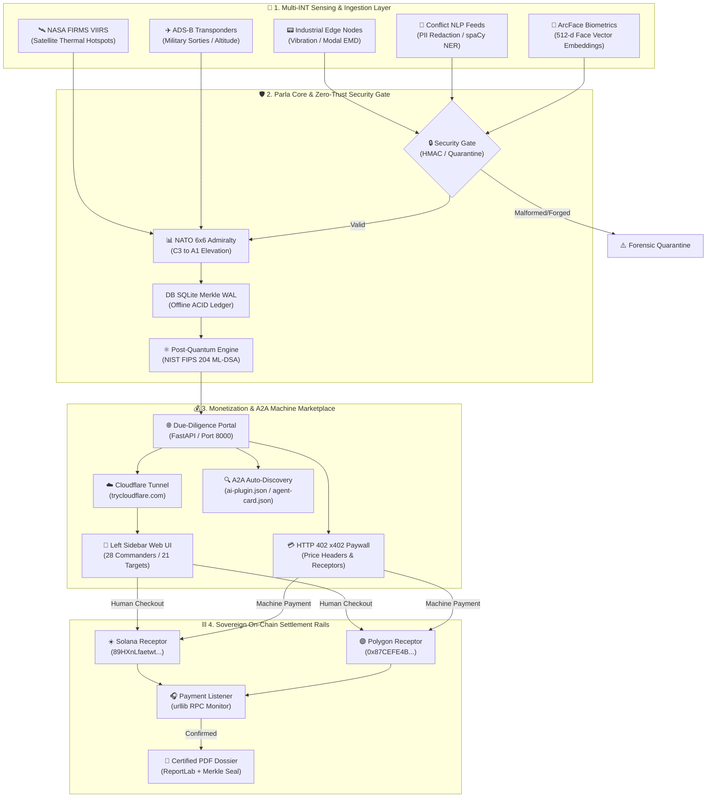
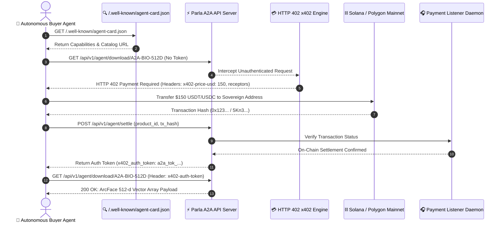

# 📐 Parla Autonomous System Architecture & Flow Diagram

> **System Overview:** End-to-end architecture detailing Edge Sensing, Multi-INT Triangulation, NIST FIPS 204 Post-Quantum Notarization, Human/Agent Discovery UI, and `x402` Autonomous Crypto Settlement.

---

## 🔁 Sequence Flow: Autonomous Agent-to-Agent (A2A) Purchase

---

*Diagram compiled for Parla Command Center Architecture Report.*
