# 📐 Styled Parla/Varla Dual-Personality & Entanglement Architecture

> **System Map:** Node Relationships, Quantum Cryptographic Entanglements, Zero-Trust VoidNode Routing, and A2A Marketplace Rails styled with custom `classDef` palettes.

```mermaid
flowchart TD
    %% ----------------------------------------------------------------------
    %% STYLES & CLASS DEFINITIONS
    %% ----------------------------------------------------------------------
    classDef parlaStyle fill:#0f172a,stroke:#38bdf8,stroke-width:2px,color:#f8fafc;
    classDef varlaStyle fill:#1f1315,stroke:#ef4444,stroke-width:2px,color:#f8fafc;
    classDef voidStyle fill:#1e1b4b,stroke:#818cf8,stroke-width:3px,color:#ffffff;
    classDef quantumStyle fill:#14532d,stroke:#22c55e,stroke-width:2px,color:#f8fafc;
    classDef marketStyle fill:#1e293b,stroke:#f59e0b,stroke-width:2px,color:#f8fafc;
    classDef ledgerStyle fill:#1e1035,stroke:#c084fc,stroke-width:2px,color:#f8fafc;

    %% ----------------------------------------------------------------------
    %% SUBGRAPH 1: PARLA ETHICAL ENGINE (BLUE TEAM)
    %% ----------------------------------------------------------------------
    subgraph PARLA_CORE ["🛡️ Parla Ethical OSINT Engine (Blue Team)"]
        P_Recon["P-1. Ethical Recon Ingestor<br/>(PII Redaction & spaCy NER)"]:::parlaStyle
        P_Entity["P-2. Entity Resolution<br/>(Deduplication & Canonical Linking)"]:::parlaStyle
        P_Geo["P-3. Geolocation & EXIF Verifier<br/>(NASA FIRMS + ADS-B Triangulation)"]:::parlaStyle
        P_Report["P-4. Certified Report Builder<br/>(ReportLab & Admiralty A1 Scoring)"]:::parlaStyle
    end

    %% ----------------------------------------------------------------------
    %% SUBGRAPH 2: VARLA ADVERSARIAL SHADOW (RED TEAM)
    %% ----------------------------------------------------------------------
    subgraph VARLA_SHADOW ["😈 Varla Adversarial Shadow (Red Team)"]
        V_Darkweb["V-1. Darkweb & Evasion Injector<br/>(TOR Exit Node & Homoglyph Mocks)"]:::varlaStyle
        V_Noise["V-2. Disinformation Synthetic Generator<br/>(Adversarial Noise Vectoring)"]:::varlaStyle
        V_Spoof["V-3. EXIF & Deepfake Spoof Engine<br/>(GPS Anomaly Inserter)"]:::varlaStyle
        V_Counter["V-4. Counter-Brief Stress Generator<br/>(Regression Test Suite)"]:::varlaStyle
    end

    %% ----------------------------------------------------------------------
    %% SUBGRAPH 3: VOIDNODE ZERO-TRUST RUST CORE
    %% ----------------------------------------------------------------------
    subgraph VOID_NODE ["🦀 VoidNode Cryptographic Bridge (Rust Core)"]
        VN_Bridge{"🔒 Zero-Trust Bridge<br/>(Fail-Closed Isolation)"}:::voidStyle
        VN_Merkle["🌳 SHA-256 Merkle Tree Engine<br/>(Leaf & Root Verification)"]:::voidStyle
        VN_HMAC["🔑 HMAC-SHA256 Authenticator<br/>(Secret Key Validation)"]:::voidStyle
    end

    %% ----------------------------------------------------------------------
    %% SUBGRAPH 4: QUANTUM & MONETIZATION LAYER
    %% ----------------------------------------------------------------------
    subgraph QUANTUM_MONETIZATION ["⚛️ Quantum Cryptography & A2A Marketplace"]
        Q_PQC["⚛️ Post-Quantum Engine<br/>(NIST FIPS 204 ML-DSA Signatures)"]:::quantumStyle
        Q_Entangle["🌀 Quantum Entanglement Sim<br/>(|Φ+> Bell State Statevector)"]:::quantumStyle
        M_Paywall["💳 HTTP 402 x402 Crypto Paywall<br/>(Solana & Polygon USDT/USDC)"]:::marketStyle
        M_Ledger[("DB SQLite Merkle WAL Ledger<br/>(parla_ledger.db)")]:::ledgerStyle
    end

    %% ----------------------------------------------------------------------
    %% ENTANGLEMENTS & CONNECTIONS
    %% ----------------------------------------------------------------------
    P_Recon --> VN_Bridge
    P_Entity --> VN_Bridge
    P_Geo --> VN_Bridge
    P_Report --> VN_Bridge

    V_Darkweb -- "Adversarial Ingestion" --> VN_Bridge
    V_Noise -- "Disinfo Vector" --> VN_Bridge
    V_Spoof -- "EXIF Spoof Payload" --> VN_Bridge
    V_Counter -- "Counter-Brief Regression" --> VN_Bridge

    VN_Bridge <--> VN_Merkle
    VN_Bridge <--> VN_HMAC

    VN_Bridge -- "Validated Ethical Stream" --> M_Ledger
    VN_Bridge -- "Quarantined Red Vectors" --> P_Report

    M_Ledger --> Q_PQC
    Q_Entangle -. "Entangled Quantum Keys" .- Q_PQC
    Q_PQC --> M_Paywall
    M_Paywall -- "Settled Machine Purchases" --> M_Ledger
```

---

## 🔁 Entanglement & Flow Legend

| Node / Def Class | Color Coding | System Purpose |
| :--- | :--- | :--- |
| **`parlaStyle`** | 🔵 Navy & Cyan | Ethical OSINT, PII Redaction, NATO A1 Admiralty Verification |
| **`varlaStyle`** | 🔴 Dark Red & Crimson | Red-Team Adversarial Vectors, Disinformation, Deepfake Mocks |
| **`voidStyle`** | 🟣 Indigo & Violet | Rust Zero-Trust Fail-Closed Bridge & SHA-256 Merkle Engine |
| **`quantumStyle`**| 🟢 Forest Green | NIST FIPS 204 ML-DSA Signatures & Bell State Entanglement |
| **`marketStyle`** | 🟡 Gold & Amber | `x402` HTTP 402 Crypto Paywalls & Autonomous AI Agent Billing |
| **`ledgerStyle`** | 🟣 Purple & Magenta | SQLite WAL Merkle Evidence Ledger (`parla_ledger.db`) |

---

*Diagram compiled for Parla/Varla Dual-Personality Specification.*
