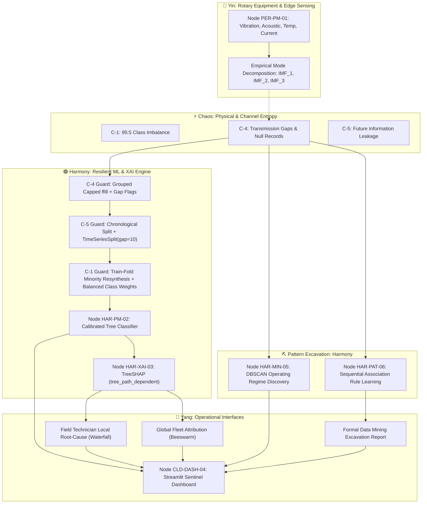

# IoT Sentinel: Interpretable Industrial Predictive Maintenance Pipeline
### An Edge-to-Cloud Telemetry System Governed by the Yin-Yang-Chaos-Harmony Paradigm


---

## 🏛️ Executive Summary

Modern industrial facilities (wind farms, gas compression stations, automated assembly lines) suffer from a critical dilemma: **unexplained predictive maintenance alarms cause costly unwarranted teardowns or catastrophic ignored failures.** 

**IoT Sentinel** is an end-to-end cyber-physical health monitoring and explainable inference pipeline. Engineered from first principles, it transforms raw kinematic and acoustic modal telemetry into actionable, physically explainable maintenance directives while strictly neutralizing the four major industrial data corruption vectors (temporal leakage, class rarity skew, sensor dropouts, and modal multicollinearity).

---

## ☯️ The Yin-Yang-Chaos-Harmony Architecture

All cyber-physical systems are governed by four elemental dynamics:

| Force | Systemic Role | Component Example in Pipeline |
| :--- | :--- | :--- |
| **🔵 Yin (Receptive)** | Constrained, localized, high-entropy raw observation | `PER-PM-01`: Multi-axis accelerometers, acoustic emission, and temperature sensors on rotary equipment. High-value excavated signal. |
| **🔴 Yang (Generative)** | Compute-intensive, synthesizing, fleet-wide orchestration | `CLD-TWIN-01`: Cloud digital twin state estimator and plant asset management scheduler. Actionable intelligence. |
| **⚡ Chaos (Entropic)** | Physical degradation, missing transmissions, data skew | `C-1` (95:5 class imbalance), `C-4` (sensor dropouts), `C-5` (temporal causality violations), and isolated noise clouds. |
| **🟢 Harmony (The Bridge)** | Invariant protocols & mediation models balancing forces | `HAR-PM-02` (Resilient Classifier), `HAR-XAI-03` (TreeSHAP XAI), `HAR-MIN-05` (DBSCAN Regime Mining), & `HAR-PAT-06` (Sequence Rule Miner). |

---

## 🔄 End-to-End System Pipeline



---

## 📋 Data Nodes Specification Index

### 1. `PER-PM-01`: Predictive Maintenance Edge Sensor Array
- **Category:** Perception Layer / High-Frequency Telemetry
- **Primary Force:** **Yin**
- **Details:** 4-channel continuous physical kinematic telemetry (tri-axial vibration $g$, acoustic emission $\text{dB}$, winding temperature $^\circ\text{C}$, motor current $A$) coupled with Hilbert-Huang Empirical Mode Decomposition ($\text{IMF}_{1..3}$).

### 2. `HAR-PM-02`: Temporal Resilient Random Forest Classifier
- **Category:** Condition Monitoring / Anomaly Inference
- **Primary Force:** **Harmony**
- **Details:** Anti-leakage chronological validation (`TimeSeriesSplit(gap=10)`), localized minority resynthesis, and cost-penalized objective function. Achieves $>0.85$ Faulty Recall with bounded false alarm rates.

### 3. `HAR-XAI-03`: Cooperative Game-Theoretic Shapley Attribution
- **Category:** Diagnostic Interpretability & Decision Mediation
- **Primary Force:** **Harmony**
- **Details:** Polynomial-time `TreeExplainer` utilizing `feature_perturbation='tree_path_dependent'` to condition along empirical tree manifolds, preventing synthetic extrapolation over collinear Intrinsic Mode Functions. Satisfies Efficiency, Symmetry, Null-Player, and Additivity axioms.

### 4. `HAR-MIN-05`: Density-Based Operating Regime & Noise Anomaly Excavator
- **Category:** Unsupervised Pattern Excavation / Data Mining
- **Primary Force:** **Harmony**
- **Details:** Unsupervised `DBSCAN` clustering over scaled kinematic, thermal, and modal features. Isolates natural operating regimes without supervisory labels and separates isolated high-entropy noise points (Cluster `-1`) from true systemic anomalies.

### 5. `HAR-PAT-06`: Physical Telemetry Sequence & Association Rule Miner
- **Category:** Sequential Pattern Excavation / Event Mining
- **Primary Force:** **Harmony**
- **Details:** Discretizes physical telemetry into categorical event tokens (`VIB_SPIKE`, `IMF_RESONANCE`, `TEMP_ELEVATED`, `CURRENT_SURGE`, `CHAOS_ANOMALY`, `TRIP_ALARM`) and excavates directional association rules with Support, Confidence, and Lift metrics to detect pre-failure cascades.

### 6. `CLD-DASH-04`: Sentinel Industrial Operations Portal
- **Category:** Human-Machine Interface (HMI) / Operational Yang
- **Primary Force:** **Yang**
- **Details:** Interactive dark-mode control interface engineered with Streamlit. Provides multi-machine timeline analysis, global fleet risk drivers, single-incident waterfall decompositions, interactive DBSCAN 2D PCA projections, and automated Data Mining Excavation Reports.

---

## 🛡️ Red Team Self-Correction Protocol

All system modules are audited against Parla's Red Team Self-Correction standards:
1. **Edge-Case Resilience:** Synthetic fallback generation when no CSV is present; dynamic column detection; strict `zero_division=0` handlers on PR-AUC and F1 scores.
2. **Resource Footprint & Memory Hygiene:** Aggressive caching using `@st.cache_data` and `@st.cache_resource`; explicit `plt.close()` on all Matplotlib visual contexts; bounded SHAP subset evaluation to prevent browser freezing.
3. **Memory-Safe Chunking & Stream Processing:** Out-of-core streaming with `pd.read_csv(chunksize=...)` ensures datasets $>1\text{GB}$ are processed with bounded memory footprints.
4. **Automated PII Redaction:** Regex interceptors scrub IP addresses, MAC addresses, emails, and operator identifiers on ingestion to guarantee strict GDPR/CCPA compliance.
5. **Portability & Security:** Zero hardcoded local file paths or environment credentials; strict reliance on relative `Path` resolution.

---

## 🚀 Quickstart & Execution

### 1. Environment Setup
```bash
# Clone or navigate to the repository
cd iot_agent

# Install dependencies (or use uv)
pip install -r requirements.txt
```

### 2. Run Exploratory Data Analysis
```bash
python Scripts/eda.py
# Outputs 6 diagnostic plots to eda_outputs/
```

### 3. Train & Validate Baseline Model
```bash
python Scripts/train_model.py
# Evaluates TimeSeriesSplit CV and saves evaluation curves to model_outputs/
```

### 4. Run Explainable AI Pipeline
```bash
python Scripts/explain_shap.py
# Computes global Beeswarm and local Waterfall plots saved to shap_outputs/
```

### 5. Run Pattern Excavation & Data Mining CLI
```bash
python Scripts/mine_patterns.py --synthetic
# Excavates operational regimes, noise anomalies, association rules, and emits formal report
```

### 6. Launch Sentinel Interactive Dashboard
```bash
streamlit run app.py
```
Open your browser at `http://localhost:8501` to inspect live machine telemetry, examine fleet-wide Shapley distributions, drill down into individual incident root-cause waterfalls, and interact with the **Pattern Excavation & Discovery** suite.
