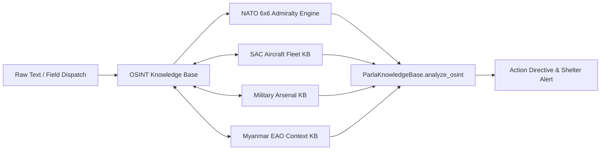

# Maximum OSINT Doctrine & Advanced Investigation Skill
### Multi-INT Fusion, Geolocation/Chronolocation, Admiralty 6x6 Corroboration, and Zero-Trace Tradecraft
*An Operations Research & Verification Standard Under the Yin-Yang-Chaos-Void-Harmony Paradigm*

## Trigger
Activated when conducting, automating, verifying, or refining Open Source Intelligence (OSINT) workflows across contested areas, conflict environments, and human rights / civilian protection monitoring. Applies to social media intelligence (SOCMINT), geospatial intelligence (GEOINT), imagery intelligence (IMINT), signals/transponder telemetry (SIGINT/ELINT), and automated verification pipelines.

---

## ☯️ The Five Forces in OSINT

| Force | Role in OSINT | Concrete Expression & Tradecraft |
| :--- | :--- | :--- |
| **🔵 Yin (Perception / Ingestion)** | Raw signal collection, sensor telemetry, passive listening | Telegram scraper feeds, local radio chatter, NASA FIRMS thermal feeds, Sentinel-2 imagery, ADS-B flight transponders, passive Shodan indexers. |
| **🔴 Yang (Synthesis / Action)** | Active analysis, multi-vector triangulation, alert generation | Corroborating a civilian airstrike report with satellite thermal anomalies and airbase radar sorties; calculating blast impact zones; dispatching early-warning sirens. |
| **⚡ Chaos (Noise / Disinformation)** | Fog of war, adversarial counter-intelligence, data rot | Coordinated inauthentic behavior (CIB), deepfakes, recycled old footage, altered metadata, missing transmissions, network blackouts. |
| **⚫ Void (The Epistemic Zero / Denial)** | The silence between transmissions, intentional denial, OPSEC | "The dog that didn't bark"—unreported strikes in areas where communication towers were pre-emptively severed; zero-trace burner workflows; sanitizing PII and micro-coordinates. |
| **🟢 Harmony (The Ledger & Standard)** | Objective verification, Admiralty 6x6 grading, cryptoseals | NATO Admiralty System grading, deterministic cross-validation formulas, Merkle-tree immutable ledger sealing for international evidentiary standards. |

---

## 🧭 1. The 5-Phase Intelligence Cycle

```
[1. Direction & Requirements] 
       ↓
[2. Multi-INT Collection] 
       ↓
[3. Processing & Sanitization] (PII Scrubbing, Geofence Fuzzing)
       ↓
[4. Triangulation & Analysis] (Admiralty 6x6, Space-Time Correlation)
       ↓
[5. Dissemination & Sealing] (Merkle Ledger, Command Dashboard)
```

1. **Direction & Requirements:** Formulate precise Priority Intelligence Requirements (PIRs): *Who, What, When, Where, Weapon, and Impact*. Avoid broad "monitoring"—define explicit entity taxonomies.
2. **Multi-INT Collection:** Never depend on single-source feeds. Simultaneously query three distinct intelligence domains:
   - **SOCMINT:** Eyewitness telegrams, Facebook local groups, regional news bulletins.
   - **GEOINT:** Thermal hotspots (NASA FIRMS VIIRS 375m), optical satellite passes (Sentinel-2, Planet Labs).
   - **SIGINT / Telemetry:** ADS-B flight tracks (OpenSky, ADS-B Exchange), VHF airbase comms, edge acoustic sensors.
3. **Processing & Sanitization:** Automatically strip PII (names, contact numbers, email, vehicle plates) and generalize micro-coordinates into sector bounding boxes to protect civilian sources.
4. **Triangulation & Analysis:** Apply the NATO Admiralty 6x6 matrix and cross-reference with domain databases (e.g. `Skill_SAC_Aircraft_Fleet_Intelligence` and `Skill_Arms_And_Armament_Matrix`).
5. **Dissemination & Sealing:** Commit verified claims with cryptographic hashes and Merkle proofs to ensure evidentiary integrity for legal and humanitarian accountability.

---

## 🛰️ 2. IMINT & Chronolocation Playbook

### A. Satellite Verification & Thermal Hotspots
1. **NASA FIRMS (Fire Information for Resource Management System):**
   - **Sensors:** VIIRS (Suomi-NPP / NOAA-20/21) at 375m resolution; MODIS at 1km resolution.
   - **Conflict Application:** Explosive munitions, burning structures, artillery barrages, and aircraft crashes generate thermal spikes detected within 3–6 hours of overpass.
   - **Verification Formula:** A report at $(lat_0, lon_0)$ at time $t_0$ is corroborated if:
     $$\text{dist}((lat_0, lon_0), (lat_{firms}, lon_{firms})) \le 15\text{ km} \quad \text{and} \quad |t_0 - t_{firms}| \le 6\text{ hours}$$

2. **Copernicus Sentinel-2 Multispectral Indices:**
   - **Normalized Burn Ratio (NBR):**
     $$\text{NBR} = \frac{\text{NIR} - \text{SWIR}}{\text{NIR} + \text{SWIR}} = \frac{B8 - B12}{B8 + B12}$$
     *Burn scar signature:* $\Delta\text{NBR} = \text{NBR}_{pre} - \text{NBR}_{post} > 0.27$ indicates severe combustion or scorched civilian settlements.
   - **Normalized Difference Vegetation Index (NDVI):**
     $$\text{NDVI} = \frac{\text{NIR} - \text{RED}}{\text{NIR} + \text{RED}} = \frac{B8 - B4}{B8 + B4}$$
     Sudden drop in green biomass flags newly bulldozed roads, trench construction, or crater fields.

### B. Shadow & Chronolocation Calculations
- **SunCalc Geometry:**
  Calculate solar azimuth $\theta_{az}$ and elevation angle $\alpha_{el}$ for coordinates $(\phi, \lambda)$ at UTC time $t$.
  $$\tan(\alpha_{el}) = \frac{h_{object}}{L_{shadow}}$$
  Given a flagpole or building of estimated height $h$ and measured shadow length $L$, the capture time can be constrained to within a 15-minute window.

---

## 🔎 3. Deep Dorking & Search Matrices

### A. Advanced Search Operators
| Intent | Dork Pattern |
| :--- | :--- |
| **Leaked Incident Reports** | `site:gov.mm OR site:mil.mm filetype:pdf ("confidential" OR "secret")` |
| **Telegram Public Channel Intel** | `site:t.me/s/ ("airstrike" OR "bombing" OR "SAC" OR "Tatmadaw") ("Sagaing" OR "Shan" OR "Kachin")` |
| **Cloud Storage Exfiltration** | `site:drive.google.com "SAC" OR "MAF" ("flight log" OR "sortie")` |
| **Social Video Archive** | `site:facebook.com/*/videos "air raid" OR "jet fighter" after:2026-01-01` |
| **Caches of Deleted Content** | `site:web.archive.org/web/*/t.me/* OR site:archive.today/*` |

### B. Network & IoT Discovery (Shodan / Censys)
- **Unsecured Airbase / Telecom Webcams:** `port:554 has_screenshot:true "Myanmar"`
- **Critical Infrastructure SCADA / Modbus:** `port:502 "Schneider" country:"MM"`
- **Exposed MQTT Brokers (Telemetry):** `port:1883 "telemetry"`

---

## ⚖️ 4. The NATO 6x6 Admiralty System

Every intelligence claim must be assigned a two-character code ($S \times C$) evaluating the source independently from the message content:

### Source Reliability (Alphabetical: A–F)
- **A — Completely Reliable:** Tested source with long history of complete accuracy (e.g. calibrated NASA sensor, accredited monitoring mission).
- **B — Usually Reliable:** Established local journalist or verified community leader with minor historical inaccuracies.
- **C — Fairly Reliable:** Eyewitness civilian with direct observation but unverified track record.
- **D — Not Usually Reliable:** Partisan actor or channel prone to sensationalism or propaganda.
- **E — Unreliable:** Source with demonstrated history of fabricating or altering claims.
- **F — Reliability Cannot Be Judged:** First-time anonymous submission without provenance.

### Information Credibility (Numerical: 1–6)
- **1 — Confirmed by Other Sources:** Directly corroborated by independent satellites, transponders, or multiple distinct sources.
- **2 — Probably True:** Highly consistent with known enemy doctrine, fleet deployments, and geographic capabilities.
- **3 — Possibly True:** Plausible claim, but lacks independent sensor corroboration.
- **4 — Doubtful:** Inconsistent with flight capabilities (e.g. claiming a helicopter flew 2,000 km without refueling).
- **5 — Improbable:** Physically impossible or contradictory to established facts.
- **6 — Truth Cannot Be Judged:** Insufficient detail to assess validity.

### Multi-Source Elevation Formula
$$\text{Final Score} = \min(1.0, \text{Base Credibility} + 0.15 \times N_{independent\_corroborations})$$
*Rule:* An initial **C3 (0.65)** claim corroborated by a NASA FIRMS thermal hotspot (+0.20) and an ADS-B transponder departure (+0.15) elevates to **A1 (0.95+)**.

---

## 🛡️ 5. Zero-Trace Anti-Forensics & Source OPSEC (The Void Pillar)

In conflict zones, an insecure OSINT database is a targeting directory for retaliatory artillery or airstrikes. Strict operational rules:

1. **Two-Tier Scrubbing Pipeline:**
   - Run Regex scrubbing for email, IPv4/v6, MAC, phone, and national ID formats.
   - Run spaCy NER with `PERSON` and `FAC` entity zeroization.
2. **Geofence Fuzzing (Micro-to-Macro):**
   - Raw coordinate $(22.12345, 95.54321)$ is immediately converted to sector hash:
     $$\text{SectorID} = \text{SHA256}(\text{round}(lat, 1) \,||\, \text{round}(lon, 1) \,||\, \text{Salt})[:16]$$
   - Only administrative sector polygons (e.g. `MYANMAR_REGION_SAGAING_SEC_02`) are stored in public/ledger layers.
3. **Cryptographic Sealing:**
   - Every normalized event is signed using node private HMAC-SHA256 keys and recorded in an append-only Merkle ledger to prove data integrity without exposing raw sources.

---

## 🧠 6. Unified Knowledge Base Integration (`parla.core.knowledge_base`)

The maximum capability of OSINT is achieved when unstructured observations are cross-referenced against structured operational models:



### A. The 9-Category Conflict Taxonomy
`OSINTKnowledgeBase` continuously classifies events against calibrated risk weights and protocols:
1. `AIRSTRIKE` (Risk: 10.0) — Jet fighters, dive-bombing, strike packages.
2. `CHEMICAL_THERMOBARIC_ATTACK` (Risk: 10.0) — ODAB-500 vacuum overpressure, chemical munitions.
3. `ARTILLERY_SHELLING` (Risk: 8.5) — 122mm/155mm howitzers, D-30, MAM-01 MLRS.
4. `DRONE_WARFARE` (Risk: 8.0) — FPV kamikaze drones, hexacopter drops, UAV reconnaissance.
5. `GROUND_CONFLICT` (Risk: 7.0) — Infantry clashes, armored columns, raids.
6. `DISPLACEMENT` (Risk: 5.0) — IDP migrations, camp bombardments, border crossings.
7. `HUMANITARIAN_CRISIS` (Risk: 8.0) — Famine, blockades, medical/water deprivation.
8. `INFRASTRUCTURE_ATTACK` (Risk: 9.0) — Hospitals, power grids, telecoms, schools, monasteries.
9. `NAVAL_SHELLING` (Risk: 7.5) — Coastal and riverbank gunboat bombardment.

### B. Cross-Domain Entity Resolution
When an event mentions a threat keyword, `analyze_osint` extracts and enriches it across three modules:
- **`sac_air` ([`SACAircraftFleetKnowledgeBase`](file:///c:/Users/james/VuZiNat/iot_agent/parla/core/knowledge_base.py#L2567)):** Resolves model name, operating bases (Tada-U, Ela, Magway), typical munition hardpoints, and acoustic micro-Doppler profiles.
- **`arms` ([`MilitaryArsenalKnowledgeBase`](file:///c:/Users/james/VuZiNat/iot_agent/parla/core/knowledge_base.py#L1965)):** Enriches blast radiuses (e.g. 150m for ODAB-500, 120m for FAB-500) and flags mass-casualty humanitarian hazards.
- **`eao` ([`MyanmarEAO2023_2025Context`](file:///c:/Users/james/VuZiNat/iot_agent/parla/core/knowledge_base.py#L454)):** Identifies local resistance or allied control zones (3BA, KNU, KIA, AA, PDF).

### C. Programmatic Query Interface
```python
from parla.core.knowledge_base import ParlaKnowledgeBase

pkb = ParlaKnowledgeBase()

result = pkb.analyze_osint(
    text="Su-30 jet dropped thermobaric bombs near Kanbalu market",
    source_reliability="C",  # NATO Source Rating (A to F)
    base_credibility=3,       # NATO Credibility Rating (1 to 6)
    corroborations=[
        {"modality": "GEOINT_THERMAL", "detail": "NASA FIRMS thermal hotspot within 3.5 km"}
    ]
)

print(result["admiralty_grade"])      # e.g. "C2" or "A1"
print(result["action_directive"])     # "URGENT_CIVILIAN_SHELTER_ALERT"
print(result["enriched_sac_threats"]) # Complete Su-30 flight & weapons specs
```

